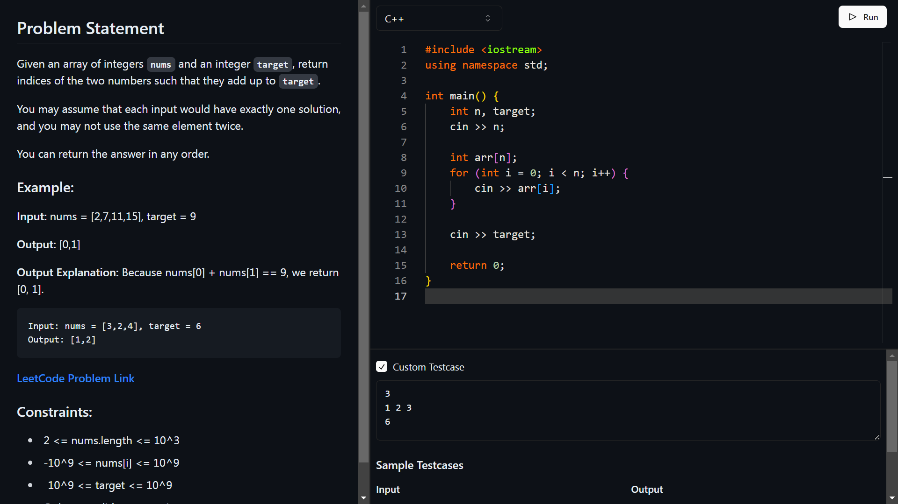

# Clash of Code 🚀

Clash of Code is a competitive programming platform that allows you to compete in real-time with your friends or colleagues. It leverages the power of Socket.IO to provide a seamless multiplayer experience over a localhost network.

> ⚠️ **NOTE:** This project is still under development. Feel free to contribute to the project by opening a issue/pull request.

## 📷 Screenshots



## 🎯 Modes

Clash of Code offers three exciting modes:

1. **Fastest Mode** - Solve the problem as fast as you can!
2. **Reverse Mode** - Guess the problem from the output!
3. **Smallest Mode** - Solve the problem with the least amount of code!

## 📚 Prerequisites

Before you begin, ensure you have met the following requirements:

- You have installed the latest version of [Node.js and npm](https://nodejs.org/en/download/).
- You have a `Windows/Mac/Linux` machine.

## 🚀 Installing Clash of Code

To install Clash of Code, follow these steps:

```bash
git clone https://github.com/your-username/clash-of-code.git
cd clash-of-code
npm install
```

## 🎮 Using Clash of Code

To start the server, run the following command:

```
npm run dev
```

Happy Coding! 🎉

## 📝 License

This project uses the following license: [MIT](https://github.com/Blank-09/clash-of-code/blob/master/LICENSE).

## 🤝 Contributing

Contributions, issues, and feature requests are welcome! Feel free to check [issues page](https://github.com/Blank-09/clash-of-code/issues).
